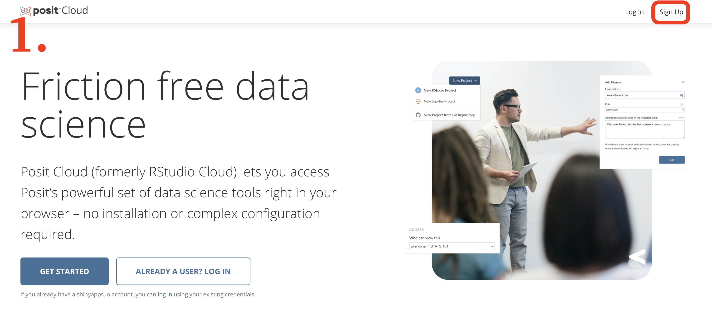
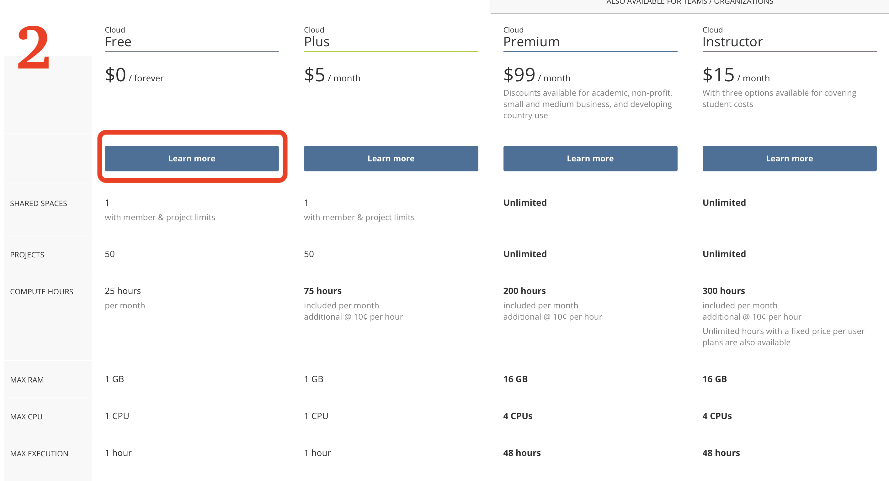
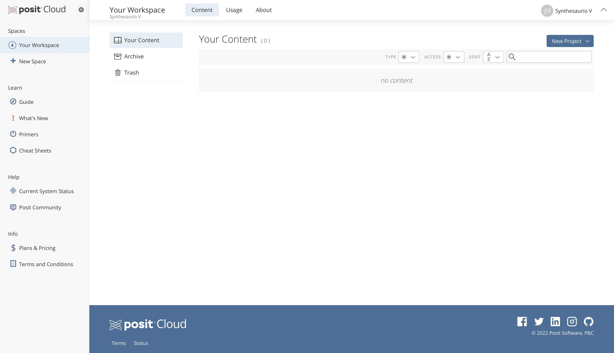

# Posit Cloud

In this workshop we will be using posit cloud, which is a web based platform to use R without the need of installing any software. All the concepts covered in this workshop are directly transferable to R and Rstudio, if you prefer to use R and R studio you are welcome to use it, but the workshop will focus on posit cloud.

Follow [this link](https://posit.cloud) to go to the posit homepage. If you don't have an account yet, click on sign up and follow the instructions to create a free account. You can either create an account or link it with a google/gmail account if you already have one.  

  
  
If you are able to see the following dashboard you are all set and ready to start the workshop!
  
  
