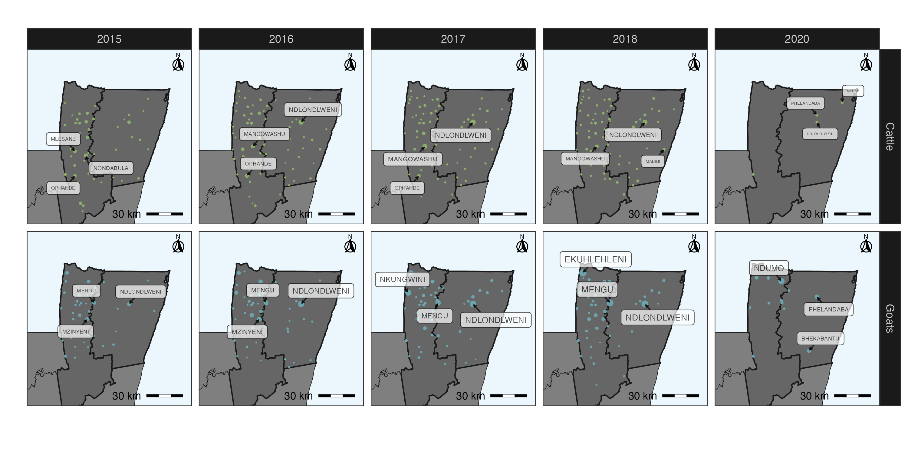
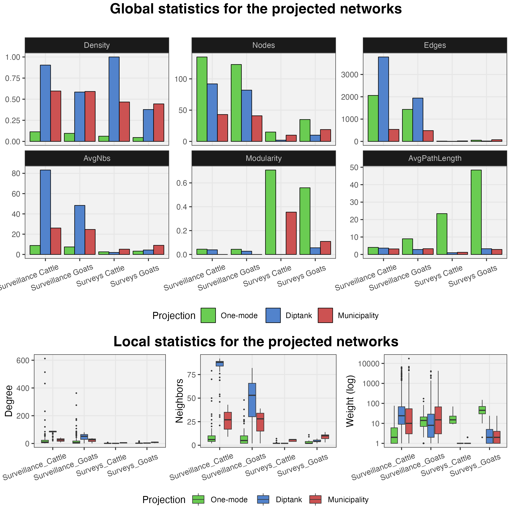
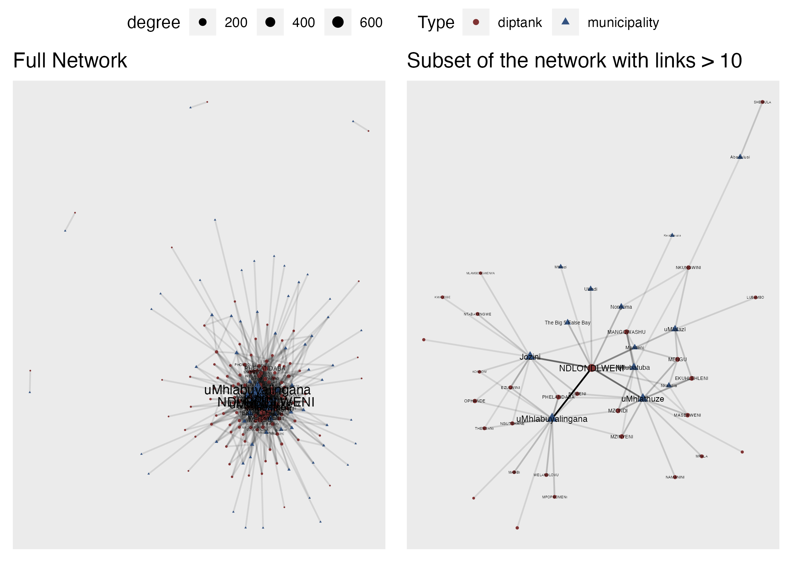

```{r message=FALSE, warning=FALSE, include=FALSE}
library(kableExtra); library(dplyr)
knitr::opts_chunk$set(echo = F)
```


# Introduction

In this workshop we will cover basics of R for animal health research.
Some concepts we cover in this workshop includes data management,
visualization, introduction to analytical methods and geographical
information systems. At the end of the workshop, the participants will have a basic understanding of R and geographical information systems. For this workshop we will be using multiple data sets with examples for animal health research.  
No software needs to be installed for this workshop, all the exercises will be done in a web based platform for cloud computing. Please follow [these instructions](0a_R_Intro.html) for setting up your posit.cloud account. All the concepts covered in this workshop are directly transferable to Rstudio for people that prefer to run the exercises locally.

# Objectives

-   Understand the basic Rstudio ecosystem and R programming language syntax.
-   Use R for data visualization.
-   Integrate geospatial data in the analysis and visualization.
-   Get a crash course in reproducible research.
-   Introduce some concepts from network theory.\
    
At the end of this workshop you will be able to use your own R to process your data and generate visualizations such as the following:





# Requisites

-   Laptop or desktop computer.\
-   A [posit.cloud](https://posit.cloud) account

<!-- ### Recommended reading -->

<!-- -   Martínez-López B, Perez AM, Sánchez-Vizcaíno JM. Social network -->

<!--     analysis. Review of general concepts and use in preventive -->

<!--     veterinary medicine. Transbound Emerg Dis. 2009 May;56(4):109-20. -->

<!--     doi: 10.1111/j.1865-1682.2009.01073.x. PMID: 19341388. -->

<!-- -   Enright J, Kao RR. Epidemics on dynamic networks. Epidemics. 2018 -->

<!--     Sep;24:88-97. doi: 10.1016/j.epidem.2018.04.003. Epub 2018 Apr 28. -->

<!--     PMID: 29907403. -->

<!-- -   Silk, M.J., Croft, D.P., Delahay, R.J., Hodgson, D.J., Weber, N., -->

<!--     Boots, M. and McDonald, R.A. (2017), The application of statistical -->

<!--     network models in disease research. Methods Ecol Evol, 8: 1026-1041. -->

<!--     <https://doi.org/10.1111/2041-210X.12770> -->

<!-- -   Farine, DR. When to choose dynamic vs. static social network -->

<!--     analysis. J Anim Ecol. 2018; 87: 128-- 138. -->

<!--     <https://doi.org/10.1111/1365-2656.12764> -->

------------------------------------------------------------------------

# Tentative schedule (all times in GMT-4)

```{r TT schedule}
data.frame(
  Time = c('', '9:00-10:00', '10:00-10:30', '10:30-10:50', '10:50-12:00', '12:00-13:00', '13:00-14:00', '14:00-14:20', '14:20-15:00'),
  D01 = cell_spec(
    c('R and data visualization', 'Introduction to R studio', 'R syntax', 'Coffee break', 'Data reduction', 'Lunch', 'Data manupulation', 'Coffee break', 'Joining data'), 'html',
    link = c('slides/Day01.html', '1a_Intro_RstudioMarkdown.html', '1b_RandTidyverse.html', 'coffeeBreak.html', '1b_RandTidyverse.html', 'Lunch.html', '1b_RandTidyverse.html', 'coffeeBreak.html', '1b_RandTidyverse.html')
  ),
  D02 = cell_spec(
    c('GIS and Network Analysis', 'Graphics in R I', 'Graphics in R II', 'Coffee break', 'Spatial Data', 'Lunch', 'Introduction to Network analysis', 'Coffee break', 'Network visualization'), 'html',
    link = c('slides/Day02.html', '1c_GraphicsI.html', '1c_GraphicsI.html', 'coffeeBreak.html', '2a_VectorsRasters.html', 'Lunch.html', '3a_NetworkIntro.html', 'coffeeBreak.html', '3b_NetworkViz.html')
  ),
  D03 = cell_spec(
    c('Risk Assessment', 'Case Studies', 'Introduction to Risk Assessment', 'Coffee break', 'Risk assessment in R I', 'Lunch', 'Feedback evaluation', 'Coffee break', 'Office Hours'), 'html',
    link = c('', '', '', '', '', 'Lunch.html', '', '', '')
  )
) %>%
  kbl("html", escape = FALSE, col.names = c('', 'May 16, 2023', 'May 17, 2023', 'May 18, 2023')) %>%
  kable_paper(full_width = F, lightable_options = c('hover')) %>%
  column_spec(1, bold = T, border_right = T) %>%
  column_spec(2, border_right = T) %>%
  column_spec(3, border_right = T) %>%
  column_spec(4, border_right = T) %>%
  row_spec(1, bold = T, extra_css = "border-bottom: 1px solid") %>%
  row_spec(c(4,6, 8), background = "#F6F5FA", italic = T)
```

## Registration:

To register the workshop, follow this [link](https://sta-uwi-edu.zoom.us/meeting/register/tJIuf-isqDotEtKd9XZ6lhMRnnrZqBgXebbq#/registration)

------------------------------------------------------------------------

## Data

The data used for this workshop is contained in the package `STNet`. To install `STNet` we need the package `devtools` and use the command `devtools::install_github("spablotemporal/STNet")`.

<!-- ------------------------------------------------------------------------ -->

## Links

-   [Shared
    folder](https://ucdavis.box.com/s/ztydby6t65nil1oh8elhnogdjisrwgcc),
    we will use this folder to provide some workshop materials such as
    code, data, or other resources.
<!-- -   [R bloggers](https://www.r-bloggers.com), Website that shares tutorials and posts from different contributors. -->

<!-- # Post workshop survey -->

<!-- ICAHS -->

<!-- We would appreciate if you take a minute to fill a quick anonymous -->

<!-- survey for feedback. To go to the survey follow [THIS LINK](Survey.html) -->

<!-- https://forms.gle/2NLzs7vLYUdumYjT9 -->

<!-- NIFNAF -->

<!-- We would appreciate if you take a minute to fill a quick anonymous survey for feedback. To go to the survey follow [THIS LINK](https://ucdavis.co1.qualtrics.com/jfe/form/SV_40oI9hjyLzb4W0K) -->


------------------------------------------------------------------------

*This course has been developed with contributions from: [Jose Pablo
Gomez-Vazquez](https://www.spablo-temporal.network), [Jerome
Baron](https://www.researchgate.net/profile/Jerome-Baron-2?_iepl%5Bcontexts%5D%5B0%5D=searchReact&_iepl%5BinteractionType%5D=headerSearchResearcher&_iepl%5Bposition%5D=1&_iepl%5BrgKey%5D=AC%3A19976637&_iepl%5Bquery%5D=jerome%20baron&_sg%5B0%5D=h0qwByBH7jEA9pnkn57dm5DqgHcuF9RNJMTd-1Y79ltjmKk1-oUwMXIy0pcjRE2CnEYq1KdLptyRR6s54PsSQTvSojEvOpxGlpJjg6kuLhyfGh3pNjLchg.RUn0HdO-b7dyxeqozqlU1rJYELS8Vbv-3SOTmOVKfhG2vntyZ18MRQemx2xzjlKdofPhapNFbhW2HCVG1gGhtw&_sg%5B1%5D=LN6moeDNOP7fMtM7A31LTwZ9q27yotxpXtAgTlLmDlxFCvXSd6qjzytmLHphEk7feO7YsBVeJEbTHCewI-A.RUn0HdO-b7dyxeqozqlU1rJYELS8Vbv-3SOTmOVKfhG2vntyZ18MRQemx2xzjlKdofPhapNFbhW2HCVG1gGhtw&_sgd%5B2%20words%5D=1&_sgd%5B10-20%20characters%5D=1)
Alejandro Zaldivar, and [Beatriz
Martinez-Lopez](https://cadms.vetmed.ucdavis.edu/about/director).\
Feel free to use these training materials for your own research and
teaching. When using the materials we would appreciate using the proper
credits. If you would be interested in a training session, please
contact: [jpgo\@ucdavis.edu](mailto:jpgo@ucdavis.edu){.email}*

------------------------------------------------------------------------
